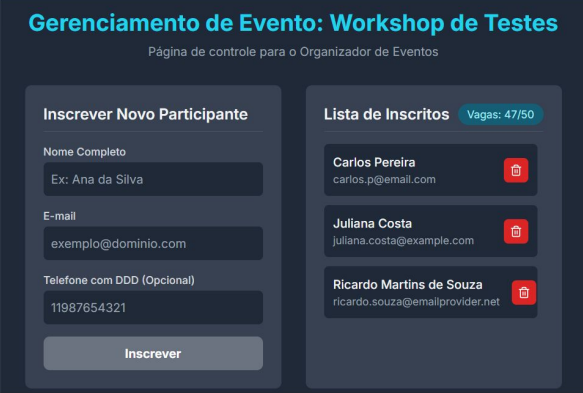

# 🚀 Scale Systems Challenge: Testing Architecture with Cypress

Este repositório contém a solução completa para o desafio técnico de automação e engenharia de qualidade da **X2 Eventos**. O projeto consiste na validação, análise de negócio e estruturação da suíte de testes para a nova plataforma interna de gerenciamento automatizado de workshops.

---

## 📸 Visão Geral da Plataforma

Abaixo está o layout atualizado da tela de cadastro de participantes avaliada neste projeto:

---

## 🎯 Contexto do Desafio & História de Usuário

**Título:** Gerenciamento de Inscrições para Eventos
> **Eu como** um organizador de eventos  
> **Preciso** adicionar um novo participante a um evento existente através de um formulário e gerenciar a lista de inscritos  
> **Para que** eu possa manter o controle do número de participantes e garantir uma comunicação eficaz com eles.

### 📋 Critérios de Aceite Originais (AC)

| ID | Critério | Regra de Negócio Detalhada |
| :--- | :--- | :--- |
| **AC1** | **Formulário de Inscrição** | Apresentar campos na tela de detalhes: Nome Completo (Obrigatório), E-mail (Obrigatório) e Telefone com DDD (Opcional). |
| **AC2** | **Validação dos Campos** | Botão "Inscrever" só habilita se os campos obrigatórios estiverem preenchidos. Validação de Regex para e-mail padrão. Nome não deve aceitar caracteres especiais ou números. |
| **AC3** | **Limite de Vagas** | Bloquear inscrições se o limite do evento for atingido. Exibir mensagem em tela: `"Vagas esgotadas!"`. |
| **AC4** | **Confirmação de Inscrição** | Exibir feedback visual: `"Inscrição realizada com sucesso!"`. Limpar o formulário imediatamente após o envio. |
| **AC5** | **Atualização da Lista** | A listagem de participantes deve reagir em tempo real, renderizando o nome e e-mail do novo inscrito. |
| **AC6** | **E-mail de Confirmação** | Disparar um e-mail de confirmação automático para o endereço de e-mail informado pelo participante. |
| **AC7** | **Remoção de Participante** | Exibir botão "Remover" (lixeira) ao lado de cada inscrito. Ao clicar, o participante é removido e a contagem de vagas do evento é atualizada. |

---

## 🗂️ Documentação Estratégica da Entrega

Toda a análise de qualidade, especificação técnica e mapeamento de riscos foram centralizados na pasta `/docs` seguindo as melhores práticas do mercado (como a norma ISO 29119-3). Clique nos links abaixo para auditar cada artefato:

1. 🧠 **[Análise Heurística & Crítica (SFDPOT)](https://github.com/daviteixeira-dev/scale-systems-challenge-testing-architecture-cypress/blob/main/docs/specs/test_analysis_heuristics.md)**: Investigação profunda baseada no modelo de James Bach. Contém o mapeamento de limites físicos, matriz *"E se...?"* de exceções, e a revisão de acessibilidade para operações no mundo real.
2. 📝 **[Plano de Testes de Software (ISO 29119-3)](https://github.com/daviteixeira-dev/scale-systems-challenge-testing-architecture-cypress/blob/main/docs/specs/test_plan.md)**: Definição formal do escopo, matriz de riscos técnicos do negócio (Foco em *Overbooking* e integridade), além das travas de qualidade (*Quality Gates*).
3. 🥒 **[Especificação de Casos de Teste (BDD / Gherkin)](https://github.com/daviteixeira-dev/scale-systems-challenge-testing-architecture-cypress/blob/main/docs/specs/test_specification.md)**: Mapeamento detalhado dos cenários de teste traduzidos em sintaxe Gherkin. Cobre desde o caminho feliz até comportamentos de resiliência de layout (*text truncation*).
4. 🐛 **[Relatório de Bugs & Insights Arquiteturais](https://github.com/daviteixeira-dev/scale-systems-challenge-testing-architecture-cypress/blob/main/docs/specs/bug_report_insights.md)**: Registro formal de defeitos críticos encontrados (incluindo o erro de lógica inversa do AC7 e inconsistência visual do contador) com sugestões de engenharia (*Debounce* e *Optimistic Updates*).

*O documento original com as diretrizes do processo seletivo encontra-se arquivado localmente em: [Processo Seletivo QA - Desafio Técnico.pdf](https://github.com/daviteixeira-dev/scale-systems-challenge-testing-architecture-cypress/blob/main/docs/Processo%20seletivo%20QA%20-%20Desafio%20T%C3%A9cnico.pdf).*
